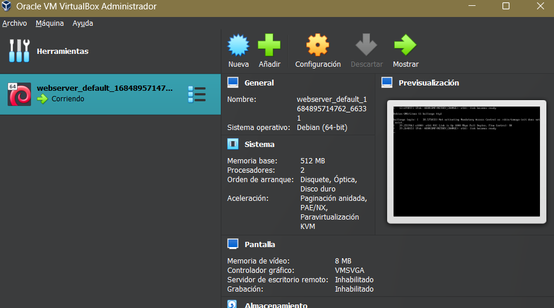

# Workshop 01 - Vagrant - Michelle Castrillo 

## Instalacion de VirtualBox              

Para proceder a la instalacion de Virtual Box debe obtener el instalador que corresponde a su arquitectura de la maquina anfitriona. Puede utlizar el siguiente enlance para hacer la descargar: [Enlace Virtual Box](https://www.virtualbox.org/wiki/Downloads "Descargar VirtualBox")

## Instalacion de Vagrant 
Puede utlizar el siguiente enlance para hacer la descargar de Vagrant: [Enlace Vagrant](https://www.vagrantup.com/downloads "Descargar Vagrant")

## Aprovisionamiento de maquina Bullseye

Para crear el espacio de trabajo: 
```bash
$ mkdir -p ISW811/VMs/webserver
$ cd ISW811/VMs/webserver

```

Crear imagen y comandos generales para la maquina: 
```bash
$ vagrant init debian/bullseye-----------imagen debian 
$ vagrant up ------------- levantar maquina 
$ vagrant ssh -------comandos desde la maquina 
$ exit--------------- salir de ssh
$ vagrant halt-----------apagar maquina
```

Maquina corriendo en VirtualBox: 


Comandos: 
