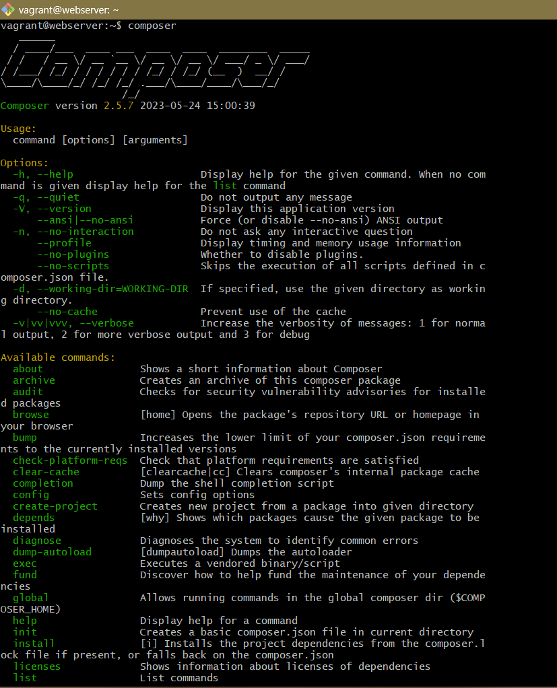
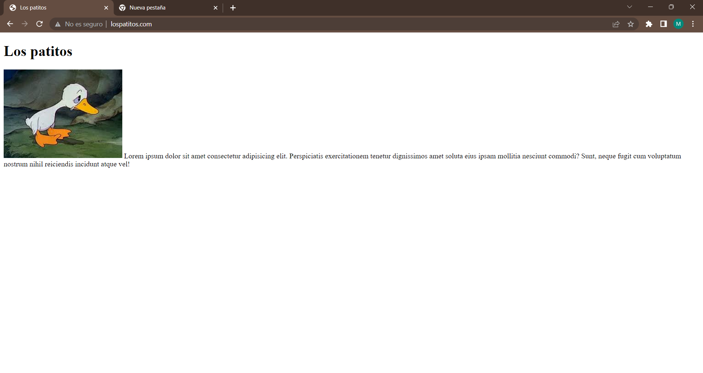
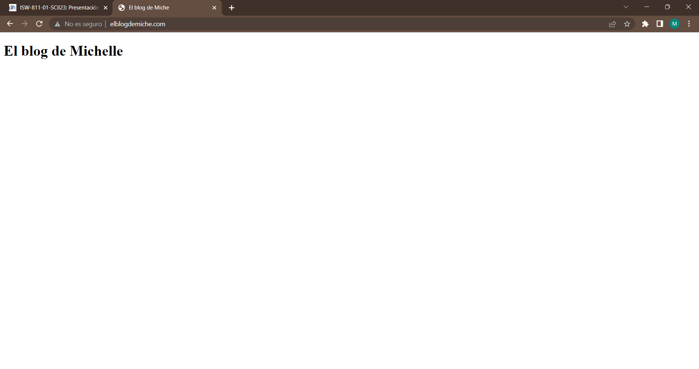
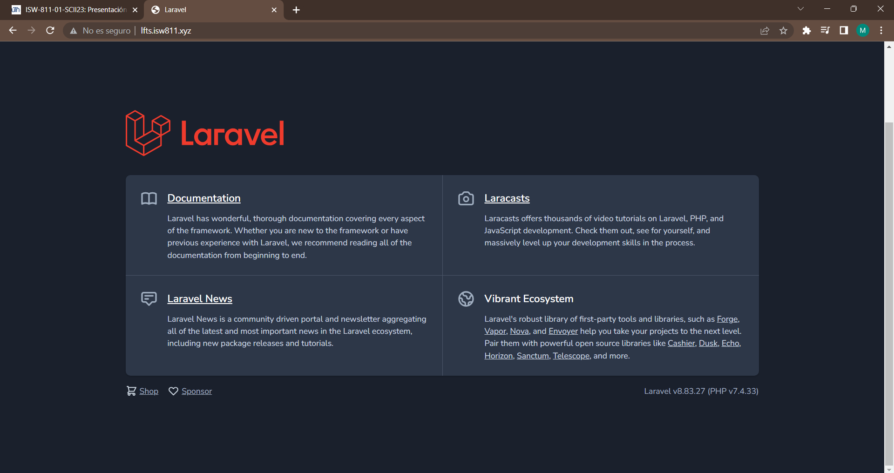

# Workshop03
1. **Iniciar la máquina:** Para iniciar la maquina virtual ingresamos la ruta donde se encuentre el Vagrantfile y ejecutamos el siguiente comando:
```bash
 cd ~/ISW811/VMs/webserver
vagrant up 
```
2. **Editar el archivo hosts:** Desde la maquina anfitriona, ejecutamos la ruta windows/system32/drivers/etc como administrador, en el archivo host insertamos la resolución del dominio deseado.
```bash
cd Windows\System32\drivers\etc
notepad hosts

------------------------------
192.168.33.10 lfts.isw811.xyz
192.168.33.10 lospatitos.com
192.168.33.10 elblogdemiche.com
------------------------------
```


3. **Crear el conf para cada sitio:** Se tiene que crear un archivo .conf para cada sitio, y así almacenar el servidor web.
```bash
cd ~/ISW811/VMs/webserver/confs
touch lospatitos.com.conf
touch elblogdemiche.com.conf
```
4. **Editar el archivo conf:** A continuación, los comandos para editar los archivos y su contenido. 
```bash  
code lospatitos.com.conf
code elblogdemiche.com.conf
 
---------------------------------------------
<VirtualHost *:80>
  ServerAdmin webmaster@dominio
  ServerName dominio

  # Indexes + Directory Root.
  DirectoryIndex index.php index.html
  DocumentRoot /home/vagrant/sites/dominio

  <Directory /home/vagrant/sites/dominio>
    DirectoryIndex index.php index.html
    AllowOverride All
    Require all granted
  </Directory>

  ErrorLog ${APACHE_LOG_DIR}/dominio.error.log
  LogLevel warn
  CustomLog ${APACHE_LOG_DIR}/dominio.access.log combined
</VirtualHost>
----------------------------------------------
```
5. **Crear folders para cada sitio:** Se crea un directorio para sitio, con su respectivo index.
```bash  
 cd ~/ISW811/VMs/webserver/sites
 mkdir elblogdemiche.com
 mkdir lospatitos.com
 touch lospatitos.com/index.html
 touch elblogdemiche.com/index.html
```
6. **Conectarse por SSH:** A continuación se conectará a la máquina virtual tipo GNU/Linux por medio ssh. 
```bash  
cd ~/ISW811/VMs/webserver
vagrant ssh 
```
7. **Copiar los confs:** Copiamos todos los archivo conf al directorio de sitios disponibles desde apache2.
```bash  
cd /vagrant/confs
sudo cp * /etc/apache2/sites-available/
```
8. **Habilitar los sitios:** Cuando los archivos se han copiado correctamente se procede a habilitarlos. 
```bash  
sudo a2ensite elblogdemiche.com.conf
sudo a2ensite lfts.isw811.xyz.conf
sudo a2ensite lospatitos.com.conf
```
  * **NOTA:** Para deshabilitar un sitio puede utilizarse el siguiente comando: sudo a2dissite
9. **Reiniciar Apache:** Antes de reiniciar Apache y habilitar los sitios correctamente se debe verificar que no haya errores con sudo apache2ctl -t. 
```bash  
sudo apache2ctl -t
sudo systemctl restart apache2.service
```

## Laravel en LAMP Server
10. **Descargar Composer:** Para poder utilizar el framework de Laravel se debe descargar un gestor de paquetes. 
[Enlace Composer](https://getcomposer.org/ "Descargar Composer") 
```bash  
php -r "copy('https://getcomposer.org/installer', 'composer-setup.php');"
php -r "if (hash_file('sha384', 'composer-setup.php') === '55ce33d7678c5a611085589f1f3ddf8b3c52d662cd01d4ba75c0ee0459970c2200a51f492d557530c71c15d8dba01eae') { echo 'Installer verified'; } else { echo 'Installer corrupt'; unlink('composer-setup.php'); } echo PHP_EOL;"
php composer-setup.php
php -r "unlink('composer-setup.php');"
```
11. **Instalar composer:** Para poder utilizar el composer de cualquier ubicación, lo recomendable es crear un enlace simbólico. 
```bash  
sudo mkdir -p /opt/composer/
sudo mv composer.phar /opt/composer/
sudo ln -s /opt/composer/composer.phar /usr/bin/composer
```


12. **Crear proyecto:** Crearemmos un proyecto Laravel versión 8.6.12
```bash  
cd vagrant/sites
composer create-project laravel/laravel:8.6.12 lfts.isw811.xyz
```

13. **Habilitar sitio:**Es importante que como en los últimos sitios, copiemos los archivo conf al directorio de sitios disponibles desde apache2. Y reiniciemos Apache. 
```bash  
cd vagrant/confs/
sudo cp lfts.isw811.xyz.conf /etc/apache2/sites-available/
sudo systemctl restart apache2.service
```
14. **Verificar sitios:** Ingresamos la url o el dominio que corresponda. 


